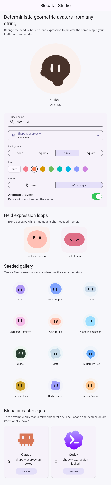

# Hiblob Flutter example

<p align="center">
  
</p>

This app provides a live editor for the local `hiblob` package. Enter any
seed, choose a generation-2 silhouette and expression from the visual bottom
sheet, then tune the hue, backdrop, and hover/always motion mode. Held
expression demos and a hover-animated 3-by-4 gallery show elapsed-time motion.
The Claude and Codex cards are fixed studio presets, so their appearance
and motion controls stay locked.

From the repository root:

```sh
cd packages/flutter/example
flutter pub get
flutter run -d chrome
```

List available devices when Chrome is not the desired target:

```sh
flutter devices
flutter run -d <device-id>
```

Run the example checks with:

```sh
flutter analyze
flutter test
```
